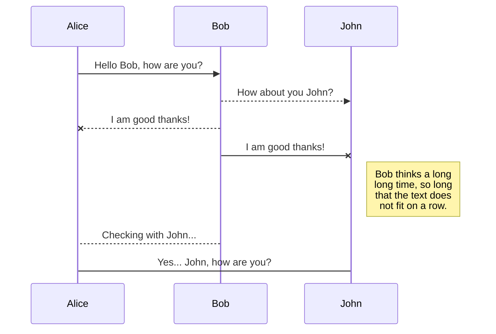
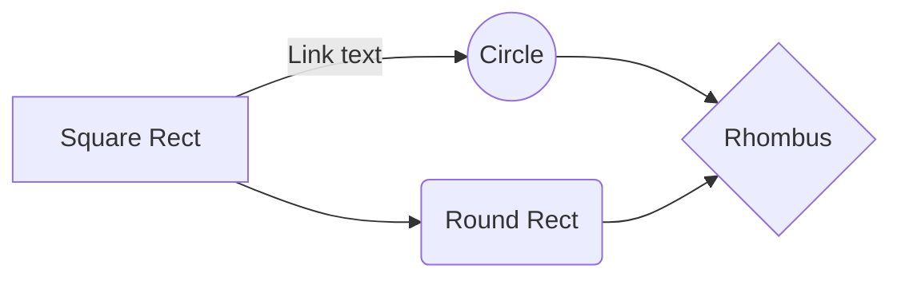

# Welcome to StackEdit!Este 
Este proyecto final trata de integrar las tecnicas aprendidas en el bootcamp de Ironhack; 

# Files

Frontend && Backend

## CVPort

## Problema técnico

Al inicar a codear en un archivo sin contexto tuve que refactorizarlo para luego añadirle un contexto que lleva gran parte de la lógica

## Build

Se tiene la carpeta principal del build del proyecto.

# Synchronization

Sincronizado a mongo Atlas para poder manejar la base de datos

## Open a file

Se accede por medio de una API rest al contenido generado a partir de la misma app 

## Save a file

Guarda los proyectos generados en una base de datos NoSql y almacena las fotos en Cloudinary

# Publication

Se ha publicado en servicios de almacenamiento en linea como Netlify y Mongo Atlas

## Publish a File

Se puede publicar un pdf que genera el contenido de tu 'Hoja de vida' para complementar tu portafolio

## Manage file publication

Since one file can be published to multiple locations, you can list and manage publish locations by clicking **File publication** in the **Publish** sub-menu. This allows you to list and remove publication locations that are linked to your file.

## SmartyPants

SmartyPants converts ASCII punctuation characters into "smart" typographic punctuation HTML entities. For example:

|                |ASCII                          |HTML                         |
|----------------|-------------------------------|-----------------------------|
|Single backticks|`'Isn't this fun?'`            |'Isn't this fun?'            |
|Quotes          |`"Isn't this fun?"`            |"Isn't this fun?"            |
|Dashes          |`-- is en-dash, --- is em-dash`|-- is en-dash, --- is em-dash|

## KaTeX

You can render LaTeX mathematical expressions using [KaTeX](https://khan.github.io/KaTeX/):

The *Gamma function* satisfying $\Gamma(n) = (n-1)!\quad\forall n\in\mathbb N$ is via the Euler integral

$$
\Gamma(z) = \int_0^\infty t^{z-1}e^{-t}dt\,.
$$

> You can find more information about **LaTeX** mathematical expressions [here](http://meta.math.stackexchange.com/questions/5020/mathjax-basic-tutorial-and-quick-reference).

## UML diagrams

You can render UML diagrams using [Mermaid](https://mermaidjs.github.io/). For example, this will produce a sequence diagram:

And this will produce a flow chart:

